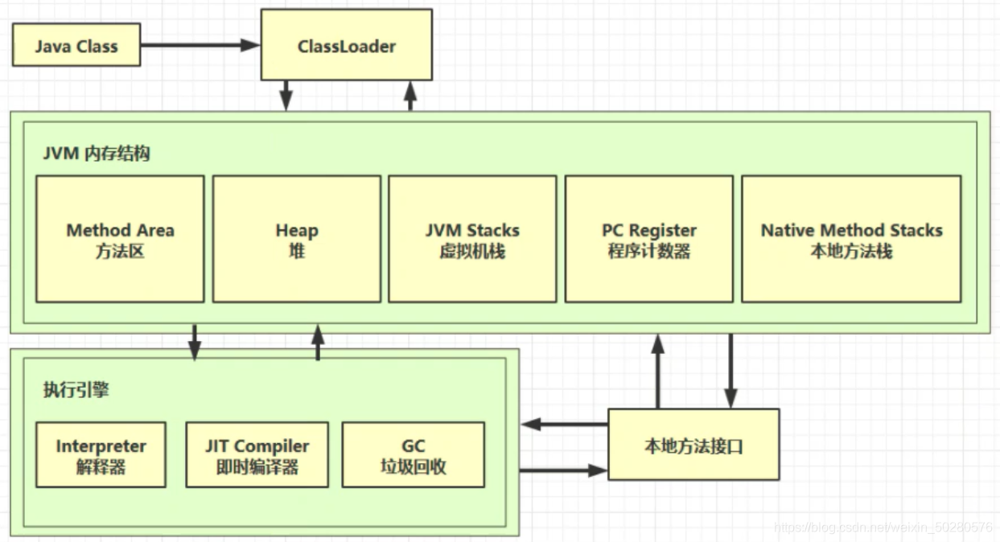
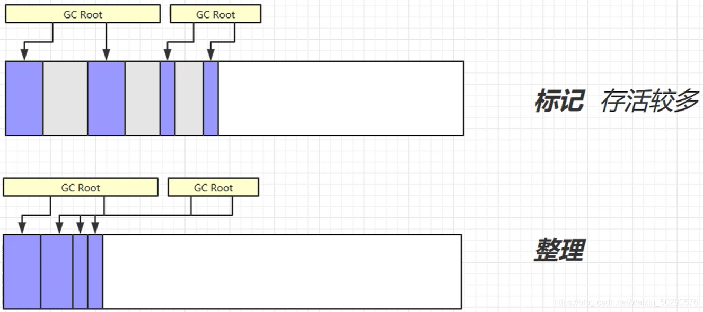
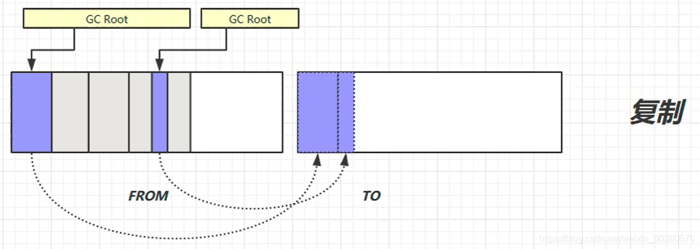
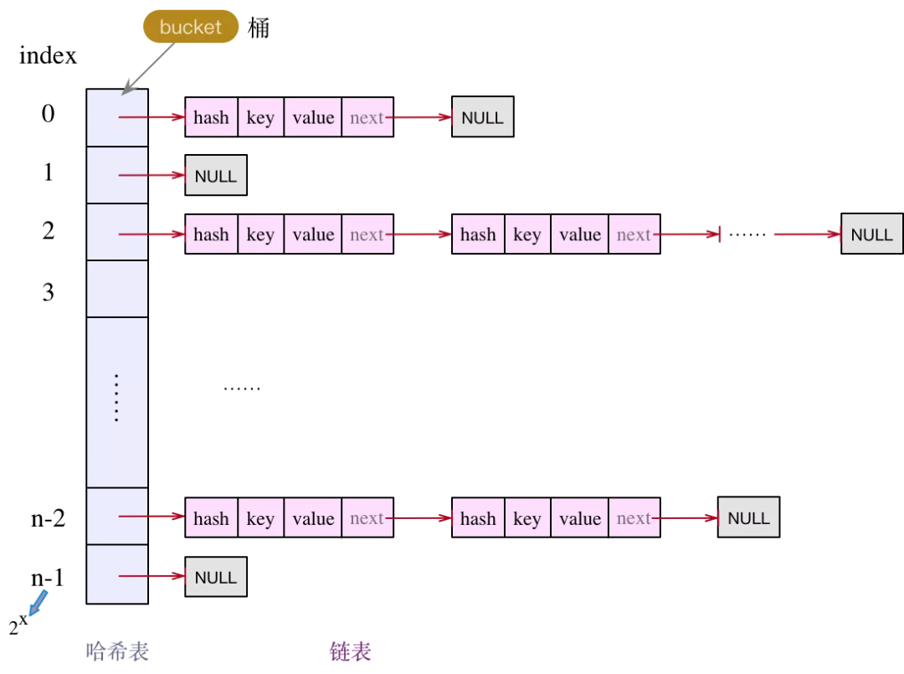

### 内存模型
> + [理解Java内存模型](https://juejin.im/post/5bf2977751882505d840321d)

> + 寄存器：最快的存储区，有编译器根据需要分配，程序中无法指定
> + 栈：存放基本类型变量数据和对象的引用，当对象本身不放在栈中，而是放在堆中（new出来的想）或者常量池中（字符串常量对象放在常量池中）
> + 堆：存放所有new出来的对象
> + 常量池：存放字符串常量和基本类型常量
> + 静态域：存放静态成员

#### 内存结构
> + 
> > [参考 - JVM 学习笔记（一）内存结构](https://blog.csdn.net/m0_45861545/article/details/120692847)
> > 1. 方法区 - Method Area（堆内存）
> > > + java文件编译成.class文件后通过ClassLoader加载到虚拟机中，将类的方法、代码、参数等保存到方法区;
> > > + 内存可以不连续；
> > > + 线程间共享；没有垃圾回收
> > 2. 堆内存 - Heap
> > > + new出来的对象实例存放到堆内存中；
> > > + 有垃圾回收机制；堆内存溢出错误
> > 3. 程序计数器 - PC Register（栈内存）
> > > + 解释器会将指令解释成机器码给到cpu执行，程序计数器会将要执行的下一条指令的地址行号给到解释器供下一次解释执行；
> > > + 记录下一条JVM执行指令的地址行号；
> > > + 线程私有；
> > > +  多线程切换时的上下文指令行号；
> > 4. 虚拟机栈 - JVM Stacks（栈内存）
> > > + 每个线程运行需要的内存空间称为虚拟机栈；
> > > + 由多个栈帧（Stack Frame）组成（局部变量表；操作数栈；动态链接、方法出口等），只有一个活动栈帧，为正在执行的方法，方法的执行过程对应一个栈帧入栈到出栈的过程；
> > > + 每个线程都有各自虚拟机栈和程序计数器;
> > > + 线程私有
> > 5. 本地方法栈 - Native Method Stacks(栈内存)
> > > + 执行native方法时使用的栈

#### JVM内存模型区别（Java 7/8/9内存模型区别）
> + [参考](https://blog.csdn.net/laomo_bible/article/details/83067810)

#### 垃圾回收算法
> + 判断对象是否需要回收？
>   + 引用计数法
>   + 可达性分析
>  >  + GC Roots
>>> + JVM栈栈帧中（局部变量表）引用的对象 ，native方法栈引用的对象
>>> + 方法区中类静态属性、常量引用的对象
> + JVM 类加载机制、垃圾回收算法对比、Java 虚拟机结构
>
##### 算法
> > + 标记-清除
> > > 
> > + 标记-整理
> > > 
> > + 复制
> > > 
> > + 分代回收
> > > 
> + Q:当你讲到分代回收算法的时候，不免会被追问到新生对象是怎么从年轻代到老年代的，以及可以作为 root 结点的对象有哪些
> + A: 堆内存氛围新生代（YoungGen）、幸存区from、幸存区to、老年代（OldGen），比例为(YoungGen : SurvivorFrom : SurvivorTo) : OldGen = (8 : 1 : 1) : 20 通常新创建的对象放在新生代，内存不够时触发Minor GC(标记-复制)，幸存的对象进入Survivor，年龄+1，每熬过一次Minor GC年龄+1，当达到15（可配置）时，进入老年代；老年代采用Major GC（标记整理、标记清除算法）；还存在永久代存放JVM加载的类文件信息、静态变量、常量
>
> + 谈谈对 JVM 的理解?
> + JVM 内存区域，开线程影响哪块区域内存？
> + 对 Dalvik、ART 虚拟机有什么了解？对比？

#### Java编译过程
问：匿名内部类，访问局部变量时为何要final
答：编译字节码时匿名内部类构造函数传入所访问的局部变量；为了保证预期一致，故匿名内部类内部改变的值不会刷新外部
  另外为何不成员变量不用加final？答：字节码中匿名内部类中持有外部类的引用，可以访问，也可以修改外部类的成员变量；

#### 类加载过程 （需要多看看，重在理解，对于热修复和插件化比较重要）
> > 

> > 1. 加载：通过classLoader将二进制文件加载到内存；并.class数据存储方法区运行时数据结构；在堆中生成Class对象作为运行时数据结构入口；
> > 2. 链接：
> > > * (1) 验证：验证字节码是否对jvm有危害，语法、逻辑是否正确
> > > * (2) 准备：类变量赋初值（类型默认值）
> > > * (3) 解析：符号引用替换为地址引用，变量、方法名、类名参数等
> > 3. 初始化：执行init()构造方法，变量赋初始值
> > 4. 使用
> > 5. 卸载
> > * 参考链接[JVM 学习笔记（一）内存结构-CodeAli](https://blog.csdn.net/weixin_50280576/article/details/113742011?spm=1001.2014.3001.5502)
> > * 参考链接[JVM 学习笔记（二）垃圾回收-CodeAli](https://blog.csdn.net/weixin_50280576/article/details/113775575?spm=1001.2014.3001.5502)
> > * 参考链接[JVM 学习笔记（三）类加载与字节码技术&内存模型-CodeAli](https://blog.csdn.net/weixin_50280576/article/details/113784268?spm=1001.2014.3001.5502)
> > * 参考链接[java类的加载过程](https://blog.csdn.net/mojir/article/details/103436878)

### 数据结构
> + 数组
> + ArrayList & LinkedList
> +  Map & Set
> + HashMap & HashSet & HashTable
> > 
> > * HashMap
> > > 1. 长度总是2^n，为什么需要这样子，默认大小是16：
> > > > * 数组的length - 1为0x0111111形式二进制值，按位与“&“运算后在高16位与低16位异或运算”^“即为该键值对的索引，这样哈希碰撞的概率降低提高查找效率，put/get都需要使用hash计算
> > > > * 当容量达到阈值时扩容需要重新计算各Entry的hash索引，此时长度为2^n作为容量可以保证只有一半的Entry需要调整位置，并能快速得出新位置的索引
> > > 2. 由数组实现，根据key的hash值确定位置，key相同情况以链表形式存储，新put的K/V生成的Entry放在链表结尾
> * [Java中Vector和ArrayList的区别](https://blog.csdn.net/qq_43170213/article/details/89335990)

### 反射

#### HOOK

### 并发

#### 并发的由来
> > * 主内存传输速度慢会拖慢cpu处理速度，故而引入传输速度更快的高速缓存（工作内存）
> > * 工作内存传输速度慢
> > * 工作内存中的处理的是主内存的副本，需要同步存在并发问题
> > > + 原子性（不可分割）
> > > + 可见性（对多核多线程多能取到最新的值）
> > > + 有序性（为提高运行效率会指令重排）
> > >
> > * [Java 并发编程上篇 -（Synchronized 原理、LockSupport 原理、ReentrantLock 原理）](https://blog.csdn.net/weixin_50280576/article/details/113033975?spm=1001.2014.3001.5502)
> > * [Java 并发编程中篇 -（JMM、CAS 原理、Volatile 原理）](https://blog.csdn.net/weixin_50280576/article/details/113532093)
> > * [Java 并发编程下篇 -（线程池）](https://blog.csdn.net/weixin_50280576/article/details/113532107)
> > * [Java 并发编程下篇 -（JUC、AQS 源码、ReentrantLock 源码）](https://blog.csdn.net/weixin_50280576/article/details/113727645)

#### synchronized 和 volatile关键字
> + volatile关键字原理，作用
> > 1. 内存屏障，保证不被cpu指令优化改变执行顺序
> > 2. 总线嗅探机制，当cpu检测到volatile变量执行写操作时，先原子执行store修改当前工作内存中的值和写回主内存中是的值，
该机制会将其他cpu工作内存中缓存的该变量副本清空失效，需要使用时需再次从主内存中读取最新值，
> + synchronized
> > 非公平锁

#### Java中ReentrantLock的使用

[Java中ReentrantLock的使用](https://blog.csdn.net/black_bird_cn/article/details/81913671)

##### 面试QA
> > + Q:volatile为什么不能保证i++
> > > A:不能保证原子性，i++ => temp = i + 1 => i = temp

> > + CAS 乐观锁
> + 乐观锁，compare and swap，UNSAFE#compareAndSwap()
内存值origin，内存值副本copy，修改后的是changed，
cas操作若copy==origin，则origin=changed。
如何保证cas同时别的线程不会cas，处理器cpu层作了限制保证原子性
https://www.cnblogs.com/myopensource/p/8177074.html

#### 线程

##### 线程有哪些状态，哪些锁，各种锁的区别
* NEW（初始化状态）、RUNNABLE（可运行状态/运行状态）、BLOCKED（阻塞状态）、WAITING（等待状态）、TIMED_WAITING（有时限的等待）、TERMINATED（终止状态）
* [理解Java线程状态（6种，6种，6种）](https://blog.csdn.net/acc__essing/article/details/127470780)

##### sleep 、wait、yield 的区别，wait 的线程如何唤醒它
> * wait和join的区别
> > wait函数：让当前线程进入等待状态，wait()会与notify()和notifyAll()方法一起使用。notify为唤醒函数
> > join函数：等待这个线程结束才能执行自已的线程。它的主要起同步作用，使线程之间的执行从“并行”变成“串行”。线程A中调用了线程B的join()方法时，线程执行过程发生改变：线程A，必须等待线程B执行完毕后，才可以继续执行下去
> > 共同点：
> > 1. 暂停当前的线程
>> 2. 都可以通过中断唤醒
不同点在于：

|    区别    |    wait    |    join    |
|-------|-------:|-------:|
| 类	| Object类 | Thread类|
| 目的	| 线程间通信	|排序，让其串行通过|
|  同步	| 必须要synchronized	|可以不用synchronized|

> * wait和sleep的区别
> > wait()：让出CPU资源和锁资源。
> > sleep(long mills)：让出CPU资源，但是不会释放锁资源。
> > 看区别，主要是看CPU的运行机制：

它们的区别主要考虑两点：1.cpu是否继续执行、2.锁是否释放掉。

> > * 归根到底：
wait，notify,notifyall 都是Object对象的方法，是一起使用的，用于锁机制，所以会释放锁
而sleep是Thread类，跟锁没关系，不会释放锁
但是两者都会让出cpu资源

##### 线程池的使用

##### 参数：
> + 核心线程数coreSize
> + 最大线程数
> > 线程数大于coreSize，queue满了是创建
> + 保活时间
> + 保活时间单位
> > 超过coreSize的其他休息时间超过该值的线程会被销毁
> + 工作队列
> > 已有线程不空闲，且queue也满了，则新建线程，并将最新的任务优先提交给新线程处理
> + 线程创建工厂
> > - 指定线程名称和守护进程
> + 拒绝策略
> > 且所有线程max size仍不空闲，queue也是满的，此时就会触发池的拒绝机制
> > - AbortPlicy 抛异常RejectedExecutionException
> > - CallerRunsPolicy 调用者执行
> > - DiscardPolicy 直接丢掉
> > - DiscardOldestPolicy 丢掉最老的任务
> > - 打印具体调用栈方便定位
> > - 间隔一段时间再次添加任务
> > - 新创建临时线程执行任务
> > - 综合组合以上方式

> > * 线程池的执行流程是：先判断当前线程数是否大于核心线程数？如果结果为 false，则新建线程并执行任务；如果结果为 true，
 则判断任务队列是否已满？如果结果为 false，则把任务添加到任务队列中等待线程执行，否则则判断当前线程数量是否超过最大线程数？如果结果为 false，
则新建线程执行此任务，否则将执行线程池的拒绝策略

### JAVA基础其他、常见提问

#### Java 四大引用

> + 强引用、软引用、弱引用、虚引用的区别以及使用场景。

> + 强引用置为 null，会不会被回收？

> + 稍微问的深一些的面试官会和内存泄漏检测原理以及垃圾回收糅杂在一起。

#### Java 的泛型， 和  的区别
