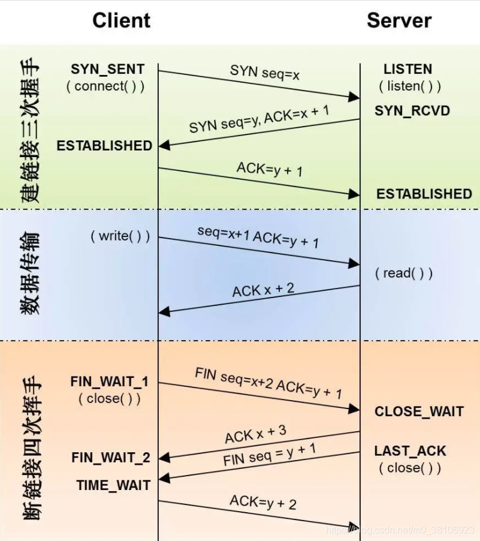

#### 通信模型及应用协议

#### HTTP、HTTPS、TCP/IP、Socket通信、三次握手四次挥手过程

> * 【问题1】为什么连接的时候是三次握手，关闭的时候却是四次握手？

> > 答：因为当Server端收到Client端的SYN连接请求报文后，可以直接发送SYN+ACK报文。其中ACK报文是用来应答的，SYN报文是用来同步的。所以建立连接只需要三次握手。
但是关闭连接时，当Server端收到FIN报文时，很可能并不会立即关闭SOCKET，所以只能先回复一个ACK报文，告诉Client端，“你发的FIN报文我收到了”。只有等到我Server端所有的报文都发送完了，我才能发送FIN报文，因此不能一起发送。故需要四步握手。

> * 【问题2】为什么TIME_WAIT状态需要经过2MSL(最大报文段生存时间)才能返回到CLOSE状态？

>> 答：虽然按道理，四个报文都发送完毕，我们可以直接进入CLOSE状态了，但是我们必须假象网络是不可靠的，有可以最后一个ACK丢失。所以TIME_WAIT状态就是用来重发可能丢失的ACK报文。在Client发送出最后的ACK回复，但该ACK可能丢失。Server如果没有收到ACK，将不断重复发送FIN片段。所以Client不能立即关闭，它必须确认Server接收到了该ACK。Client会在发送出ACK之后进入到TIME_WAIT状态。Client会设置一个计时器，等待2MSL的时间。如果在该时间内再次收到FIN，那么Client会重发ACK并再次等待2MSL。所谓的2MSL是两倍的MSL(Maximum Segment Lifetime)。MSL指一个片段在网络中最大的存活时间，2MSL就是一个发送和一个回复所需的最大时间。如果直到2MSL，Client都没有再次收到FIN，那么Client推断ACK已经被成功接收，则结束TCP连接。

> * 【问题3】为什么需要三次握手？为什么不能用两次握手进行连接？

>> 答：3次握手完成两个重要的功能，既要双方做好发送数据的准备工作(双方都知道彼此已准备好)，也要允许双方就初始序列号进行协商，这个序列号在握手过程中被发送和确认。

> > 如果使用两次握手就建立连接，就会出现出现以下情况：
> > 我们假设client发出的第一个连接请求报文段并没有丢失，而是在某个网络结点长时间的滞留了，以致延误到连接释放以后的某个时间才到达server。本来这是一个早已失效的报文段。但server收到此失效的连接请求报文段后，就误认为是client再次发出的一个新的连接请求。于是就向client发出确认报文段，同意建立连接。
>假设采用“两次握手”，那么只要server发出确认，新的连接就建立了。由于现在client并没有发出建立连接的请求，因此不会理睬server的确认，也不会向server发送数据。但server却以为新的运输连接已经建立，并一直等待client发来数据。这样，server的很多资源就白白浪费掉了。
>把三次握手改成仅需要两次握手，死锁是可能发生的。作为例子，考虑计算机S和C之间的通信，假定C给S发送一个连接请求分组，S收到了这个分组，并发送了确认应答分组。按照两次握手的协定，S认为连接已经成功地建立了，可以开始发送数据分组。可是，C在S的应答分组在传输中被丢失的情况下（第二次握手丢失），将不知道S是否已准备好，不知道S建立什么样的序列号，C甚至怀疑S是否收到自己的连接请求分组。在这种情况下，C认为连接还未建立成功，将忽略S发来的任何数据分组，只等待连接确认应答分组。而S在发出的分组超时后，重复发送同样的分组。这样就形成了死锁。

> * 【问题4】如果已经建立了连接，但是客户端突然出现故障了怎么办？
>> TCP还设有一个保活计时器，显然，客户端如果出现故障，服务器不能一直等下去，白白浪费资源。服务器每收到一次客户端的请求后都会重新复位这个计时器，时间通常是设置为2小时，若两小时还没有收到客户端的任何数据，服务器就会发送一个探测报文段，以后每隔75秒钟发送一次。若一连发送10个探测报文仍然没反应，服务器就认为客户端出了故障，接着就关闭连接。
>> [参考原文链接](https://blog.csdn.net/m0_45861545/article/details/120692847)

#### TCP / UDP & 应用场景
> 

> + TCP的全称是Transmission Control Protocol，它被称为是一种面向连接的协议，这是因为一个应用程序开始向另一个应用程序发送数据之前，这两个进程必须先进行握手，握手是一个逻辑连接，并不是两个主机之间进行真实的握手。
> > * 面向连接：一定是「一对一」才能连接，不能像UDP协议可以一个主机同时向多个主机发送消息，也就是一对多是无法做到的；
> > * 可靠的：无论的网络链路中出现了怎样的链路变化，TCP都可以保证一个报文一定能够到达接收端；
> > * 字节流：消息是「没有边界」的，所以无论我们消息有多大都可以进行传输。并且消息是「有序的」，当「前一个」消息没有收到的时候，即使它先收到了后面的字节已经 收到，那么也不能扔给应用层去处理，同时对「重复」的报文会自动丢弃。

> + UDP的全称是User Datagram Protocol，它被称为是一种面向无连接的协议，对自己提供的连接实施控制。适用于实时应用，例如：IP电话、视频会议、直播等，以报文的方式传输，效率高，即使知道有破坏的包也不进行重发。
> > * 无连接: 知道对端的IP和端口号就直接进行传输, 不需要建立连接.
> > * 不可靠: 没有确认机制, 没有重传机制; 如果因为网络故障该段无法发到对方, UDP协议层也不会给应用层返回任何错误信息.
> > * 面向数据报: 不能够灵活的控制读写数据的次数和数量.

#### HTTP1.0 & HTTP2.0区别
> + HTTP1.0
> > + 默认使用 Connection:cloose，浏览器每次请求都需要与服务器建立一个 TCP 连接，服务器处理完成后立即断开 TCP 连接（无连接），服务器不跟踪每个客户端也不记录过去的请求（无状态）。
> + HTTP1.1
> > + 默认使用 Connection:keep-alive（长连接），避免了连接建立和释放的开销；通过 Content-Length 字段来判断当前请求的数据是否已经全部接受。不允许同时存在两个并行的响应。
> > * 缺点：
> > > * 高延迟，带来页面加载速度的降低。（网络延迟问题只要由于队头阻塞，导致宽带无法被充分利用）
> > > * 无状态特性，带来巨大的Http头部。
> > > * 明文传输，不安全。
> > > * 不支持服务器推送消息。
> * HTTP2.0 新特性
> > > > 1. 二进制传输 将请求和响应数据分割为更小的帧，并且它们采用二进制编码(http1.0基于文本格式)。多个帧之间可以乱序发送，根据帧首部的流表示可以重新组装。
> > > > 2. Header压缩 开发了专门的“HPACK”算法，大大压缩了Header信息。
> > > > 3. 多路复用 引入了多路复用技术，很好的解决了浏览器限制同一个域名下的请求数量的问题。多路复用技术可以只通过一个TCP链接就可以传输所有的请求数据。
> > > > 4. 服务端推送 在一定程度上改不了传统的“请求-应答”工作模式，服务器不再完全被动地响应请求，也可以新建“流”主动向客户端发送消息。（例如，浏览器在刚请求html的时候就提前把可能会用到的JS，CSS文件发送给客户端，减少等待延迟，这被称为“服务端推送Server Push”）;服务器也不能随便将第三方资源推送给服务器，必须经过双方确认。
> * HTTP2.0缺点
> > > 1. TCP以及TCP+TLS建立连接的延迟（握手延迟）
> >> 2. TCP的队头阻塞没有彻底解决（http2.0中，多个请求是跑在一个TCP管道中的，一旦丢包，TCP就要等待重传（丢失的包等待重新传输确认），从而阻塞该TCP连接中的所有请求）

> * Http3.0
> > Google在推行SPDY的时候意识到了上述http2.0一系列问题，于是又产生了基于UDP协议的“QUIC”协议，让HTTP跑在QUIC上而不是TCP上。从而产生了HTTP3.0版本，它解决了“队头阻塞”的问题。
> 特点：
> （1）实现了类似TCP的流量控制，传输可靠性的功能。
>
> （2）实现了快速握手功能（QUIC基于UDP，UDP是面向无连接的，不需要握手和挥手，比TCP快）
>
> （3）集成了TLS加密功能
>
> （4）多路复用，彻底解决TCP中队头阻塞的问题（单个“流”是有序的，可能会因为丢包而阻塞，但是其他流不会受到影响）
>
> 总结
> HTTP1.1的缺点：安全性不足和性能不高；
> HTTP2.0完全兼容HTTTP1.0，是“更安全的HTTP，更快的HTTPS”，头部压缩，多路复用等技术充分利用了带宽，降低了延迟。
> HTTP3.0的底层支撑协议QUIC基于UDP实现，又含TCP的特点，实现了又快又可靠的协议。

#### 常见Q&A：
> + TCP 有哪些状态

> + 三次握手、四次挥手。为啥不是三次不是两次

> + HTTPS 和 HTTP 的区别，HTTPS 2.0 3.0？

> + 浏览器输入一个 URL 按下回车网络传输的流程？

> + 问的深一点的可能涉及到网络架构，每层有什么协议，FTP 相关原理，例：TCP 建立连接后，发包频率是怎么样的？
