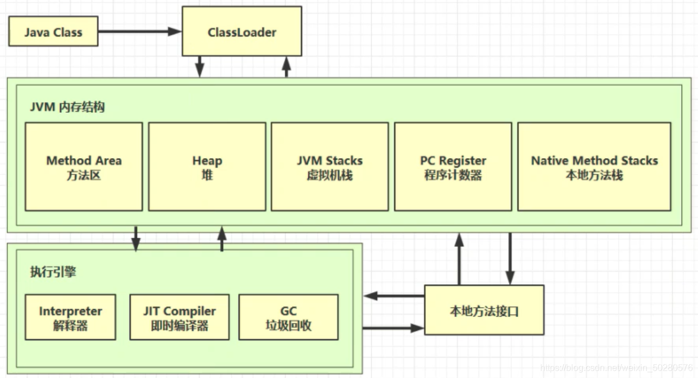
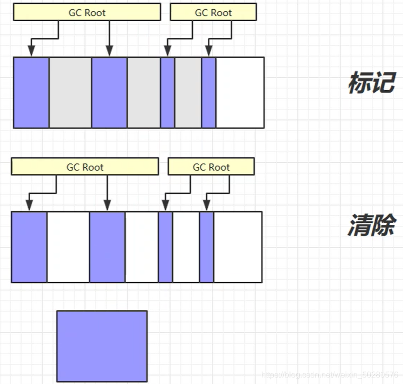
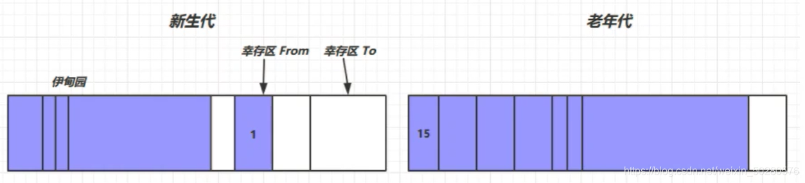

## Java基础知识


### 内存模型
> + 理解Java内存模型   https://juejin.im/post/5bf2977751882505d840321d
#### 内存结构
> + 
> > [参考 - JVM 学习笔记（一）内存结构](https://blog.csdn.net/m0_45861545/article/details/120692847)
> > 1. 方法区 - Method Area（堆内存）
> > > + java文件编译成.class文件后通过ClassLoader加载到虚拟机中，将类的方法、代码、参数等保存到方法区;
> > > + 内存可以不连续；
> > > + 线程间共享；没有垃圾回收
> > 2. 堆内存 - Heap
> > > + new出来的对象实例存放到堆内存中；
> > > + 有垃圾回收机制；堆内存溢出错误
> > 3. 程序计数器 - PC Register（栈内存）
> > > + 解释器会将指令解释成机器码给到cpu执行，程序计数器会将要执行的下一条指令的地址行号给到解释器供下一次解释执行；
> > > + 记录下一条JVM执行指令的地址行号；
> > > + 线程私有；
> > > +  多线程切换时的上下文指令行号；
> > 4. 虚拟机栈 - JVM Stacks（栈内存）
> > > + 每个线程运行需要的内存空间称为虚拟机栈；
> > > + 由多个栈帧（Stack Frame）组成（局部变量表；操作数栈；动态链接、方法出口等），只有一个活动栈帧，为正在执行的方法，方法的执行过程对应一个栈帧入栈到出栈的过程；
> > > + 每个线程都有各自虚拟机栈和程序计数器;
> > > + 线程私有
> > 5. 本地方法栈 - Native Method Stacks(栈内存)
> > > + 执行native方法时使用的栈

#### JVM内存模型区别（Java 7/8/9内存模型区别）
> + https://blog.csdn.net/laomo_bible/article/details/83067810

#### 垃圾回收算法
> + 判断对象是否需要回收？
>   + 引用计数法
>   + 可达性分析
>  >  + GC Roots
>>> + JVM栈栈帧中（局部变量表）引用的对象 ，native方法栈引用的对象
>>> + 方法区中类静态属性、常量引用的对象
> + JVM 类加载机制、垃圾回收算法对比、Java 虚拟机结构
> 
##### 算法
> > + 标记-清除
> > > 
> > + 标记-整理
> > > 
> > + 复制
> > > 
> > + 分代回收
> > > 
> + Q:当你讲到分代回收算法的时候，不免会被追问到新生对象是怎么从年轻代到老年代的，以及可以作为 root 结点的对象有哪些
> + A: 堆内存氛围新生代（YoungGen）、幸存区from、幸存区to、老年代（OldGen），比例为(YoungGen : SurvivorFrom : SurvivorTo) : OldGen = (8 : 1 : 1) : 20 通常新创建的对象放在新生代，内存不够时触发Minor GC(标记-复制)，幸存的对象进入Survivor，年龄+1，每熬过一次Minor GC年龄+1，当达到15（可配置）时，进入老年代；老年代采用Major GC（标记整理、标记清除算法）；还存在永久代存放JVM加载的类文件信息、静态变量、常量
>   
> + 谈谈对 JVM 的理解?  
> + JVM 内存区域，开线程影响哪块区域内存？ 
> + 对 Dalvik、ART 虚拟机有什么了解？对比？

#### 类加载过程 （需要多看看，重在理解，对于热修复和插件化比较重要）


### 数据结构
> + 数组
> + ArrayList & LinkedList
> +  Map & Set
> + HashMap & HashSet & HashTable


### 反射

#### HOOK


### 并发

#### 并发的由来
> > * 主内存传输速度慢会拖慢cpu处理速度，故而引入传输速度更快的高速缓存（工作内存）
> > * 工作内存传输速度慢
> > * 工作内存中的处理的是主内存的副本，需要同步存在并发问题
> > > + 原子性（不可分割）
> > > + 可见性（对多核多线程多能取到最新的值）
> > > + 有序性（为提高运行效率会指令重排）

#### synchronized 和 volatile关键字

##### 面试QA
>> + Q:volatile为什么不能保证i++
>> > A:不能保证原子性，i++ => temp = i + 1 => i = temp
>> > 
CAS 乐观锁

#### 线程

##### 线程有哪些状态，哪些锁，各种锁的区别

##### sleep 、wait、yield 的区别，wait 的线程如何唤醒它

##### 线程池的使用

##### 参数：
> + 核心线程数coreSize
> + 最大线程数
> > 线程数大于coreSize，queue满了是创建
> + 保活时间
> + 保活时间单位
> > 超过coreSize的其他休息时间超过该值的线程会被销毁
> + 工作队列
> > 已有线程不空闲，且queue也满了，则新建线程，并将最新的任务优先提交给新线程处理
> + 线程创建工厂
> > - 指定线程名称和守护进程
> + 拒绝策略
> > 且所有线程max size仍不空闲，queue也是满的，此时就会触发池的拒绝机制
> > - AbortPlicy 抛异常RejectedExecutionException
> > - CallerRunsPolicy 调用者执行
> > - DiscardPolicy 直接丢掉
> > - DiscardOldestPolicy 丢掉最老的任务


### 网络通信

#### 通信模型及应用协议

#### HTTP、HTTPS、TCP/IP、Socket通信、三次握手四次挥手过程

> * 【问题1】为什么连接的时候是三次握手，关闭的时候却是四次握手？

> > 答：因为当Server端收到Client端的SYN连接请求报文后，可以直接发送SYN+ACK报文。其中ACK报文是用来应答的，SYN报文是用来同步的。所以建立连接只需要三次握手。
但是关闭连接时，当Server端收到FIN报文时，很可能并不会立即关闭SOCKET，所以只能先回复一个ACK报文，告诉Client端，“你发的FIN报文我收到了”。只有等到我Server端所有的报文都发送完了，我才能发送FIN报文，因此不能一起发送。故需要四步握手。

> * 【问题2】为什么TIME_WAIT状态需要经过2MSL(最大报文段生存时间)才能返回到CLOSE状态？

>> 答：虽然按道理，四个报文都发送完毕，我们可以直接进入CLOSE状态了，但是我们必须假象网络是不可靠的，有可以最后一个ACK丢失。所以TIME_WAIT状态就是用来重发可能丢失的ACK报文。在Client发送出最后的ACK回复，但该ACK可能丢失。Server如果没有收到ACK，将不断重复发送FIN片段。所以Client不能立即关闭，它必须确认Server接收到了该ACK。Client会在发送出ACK之后进入到TIME_WAIT状态。Client会设置一个计时器，等待2MSL的时间。如果在该时间内再次收到FIN，那么Client会重发ACK并再次等待2MSL。所谓的2MSL是两倍的MSL(Maximum Segment Lifetime)。MSL指一个片段在网络中最大的存活时间，2MSL就是一个发送和一个回复所需的最大时间。如果直到2MSL，Client都没有再次收到FIN，那么Client推断ACK已经被成功接收，则结束TCP连接。

> * 【问题3】为什么需要三次握手？为什么不能用两次握手进行连接？

>> 答：3次握手完成两个重要的功能，既要双方做好发送数据的准备工作(双方都知道彼此已准备好)，也要允许双方就初始序列号进行协商，这个序列号在握手过程中被发送和确认。

>> 如果使用两次握手就建立连接，就会出现出现以下情况：

>> 我们假设client发出的第一个连接请求报文段并没有丢失，而是在某个网络结点长时间的滞留了，以致延误到连接释放以后的某个时间才到达server。本来这是一个早已失效的报文段。但server收到此失效的连接请求报文段后，就误认为是client再次发出的一个新的连接请求。于是就向client发出确认报文段，同意建立连接。
>假设采用“两次握手”，那么只要server发出确认，新的连接就建立了。由于现在client并没有发出建立连接的请求，因此不会理睬server的确认，也不会向server发送数据。但server却以为新的运输连接已经建立，并一直等待client发来数据。这样，server的很多资源就白白浪费掉了。
>把三次握手改成仅需要两次握手，死锁是可能发生的。作为例子，考虑计算机S和C之间的通信，假定C给S发送一个连接请求分组，S收到了这个分组，并发送了确认应答分组。按照两次握手的协定，S认为连接已经成功地建立了，可以开始发送数据分组。可是，C在S的应答分组在传输中被丢失的情况下（第二次握手丢失），将不知道S是否已准备好，不知道S建立什么样的序列号，C甚至怀疑S是否收到自己的连接请求分组。在这种情况下，C认为连接还未建立成功，将忽略S发来的任何数据分组，只等待连接确认应答分组。而S在发出的分组超时后，重复发送同样的分组。这样就形成了死锁。
>
>* 【问题4】如果已经建立了连接，但是客户端突然出现故障了怎么办？

>> TCP还设有一个保活计时器，显然，客户端如果出现故障，服务器不能一直等下去，白白浪费资源。服务器每收到一次客户端的请求后都会重新复位这个计时器，时间通常是设置为2小时，若两小时还没有收到客户端的任何数据，服务器就会发送一个探测报文段，以后每隔75秒钟发送一次。若一连发送10个探测报文仍然没反应，服务器就认为客户端出了故障，接着就关闭连接。
原文链接：https://blog.csdn.net/m0_45861545/article/details/120692847


#### TCP / UDP & 应用场景

#### HTTP1.0 & HTTP2.0区别

#### 常见Q&A：
> + TCP 有哪些状态

> + 三次握手、四次挥手。为啥不是三次不是两次

> + HTTPS 和 HTTP 的区别，HTTPS 2.0 3.0？

> + 浏览器输入一个 URL 按下回车网络传输的流程？

> + 问的深一点的可能涉及到网络架构，每层有什么协议，FTP 相关原理，例：TCP 建立连接后，发包频率是怎么样的？


### JAVA基础其他、常见提问

#### Java 四大引用

> + 强引用、软引用、弱引用、虚引用的区别以及使用场景。

> + 强引用置为 null，会不会被回收？

> + 稍微问的深一些的面试官会和内存泄漏检测原理以及垃圾回收糅杂在一起。

#### Java 的泛型， 和  的区别

## 编程思想

hi


.
### 面向对象


### 面向过程


### 切面

#### 字节码插桩

### 设计模式（六大基本原则、项目中常用的设计模式、手写单例等）

> + 生产者模式和消费者模式的区别？

> + 单例模式双重加锁，为什么这样做？

> + 知道的设计模式有哪些？

> + 项目中常用的设计模式有哪些？

> + 手写生产者、消费者模式。

> + 手写观察者模式代码。

> + 适配器模式、装饰者模式、外观模式的异同？

> + 谈谈对 java 状态机的理解。

> + 谈谈应用更新（灰度、强制更新、分区更新？）


## Android


### MVC & MVP & MVVM
* MVC
> 优点：视图与模型分离，通过控制器实现交互，低耦合高复用
> 缺点：在Android开发中，activity既是视图也是控制器，业务界面复杂时相当臃肿不变维护扩展，职责不明确，v可以直接操作m耦合性高

* MVP
> 优点：通过p将m和v完全分离，activity只负责显示和用户交互，m和p交互，v和p交互，职责明确，代码简洁。复杂逻辑放到presenter纽带。便于单元测试通过接口交互
> 缺点：

* MVVM
> 优点：更加释放m和v的压力，数据双向绑定，m和p变成viewmodel
> 缺点：

* MVVM和MVP的关系：MVVM 模式将 Presenter 改名为 ViewModel，基本上与 MVP 模式完全一致。Presenter与View的交互是通过接口来进行的。 2、唯一的区别是，MVVM采用双向绑定（data-binding）：View的变动，自动反映在 ViewModel，反之亦然，model变动通过livedata监听发应给view。这样开发者就不用处理接收事件和View更新的工作，框架已经帮你做好了。
* MVC & MVP区别：

### BInder

### 四大组件

> + Activity
> + Service
> + Broadcast Receiver
> + ContentProvider

###  自定义 View* 

###  事件拦截分发

+ 事件分发已经不是直接让你讲了，会给你具体的场景，比如 A 嵌套 B ，B 嵌套 C，从 C 中心按下，一下滑出到 A，事件分发的过程，这里面肯定会有 ACTION_CANCEL 的相关调用时机。

### ANR

### 内存泄漏


### OOM


### 常见框架

> + Glide
> + RxJava
> + OkHttp
> + Retrofit
> + CC
> +动态换肤
> + Jetpack architecture
> > + ViewModel Livedata
> > + Lifecycle
> > + Compose

###  解决过的一些性能问题，在项目中的实际运用

#### 性能优化 

> + 工具
(TraceView、Systrace、调试 GPU 过度绘制 & GPU 呈现模式分析、Hierarchy Viewer、MAT、Memory Monitor & Heap Viewer & Allocation Tracker 等）

> + 调优  （讲讲你自己项目中做过的性能优化）

>> 1. 网络：API 优化、流量优化、弱网优化  
>> 2. 内存：OOM 处理、内存泄漏、内存检测、分析、Bitmap 优化 ,LeakCanary 原理，什么检测内存泄漏需要两次？
>> 3. 绘制 
>> 4. 电量：WeakLock 机制、JobScheduler 机制  
>> 5. APK 瘦身 （APK 瘦身是怎么做的，只用 armabi-v7a 没有什么问题么？
   APK 瘦身这个基本是 100% 被面试问到，可能是我简历上提到的原因。）  
>> 6. 内存抖动  
>> 7. 内存泄漏  
>> 8. 卡顿 {如何检测卡顿，卡顿原理是什么，怎么判断页面响应卡顿还是逻辑处理造成的卡顿} ，BlockCanary 的原理 
>> 9. 布局优化、过度渲染处理、ANR 处理、监控、埋点、Crash 上传。 
>> 10. 启动优化
>> Glide ：**加载、缓存、LRU 算法  
(如何自己设计一个大图加载框架)  
（LRUCache 原理）

2. EventBus

3. LeakCanary

4. ARouter

```
重点：Router 原理，如何实现组件间的通信，组件化平级调用数据的方式。
```

**5. 插件化**（不同插件化机制原理与流派，优缺点。局限性）


**6. 热修复**

7. RXJava  
（RxJava 的线程切换原理）


8. Retrofit  
（Retrofit 在 OkHttp 上做了哪些封装？动态代理和静态代理的区别，是怎么实现的）


OkHttp


1、OkHttp 源码，网络缓存 
2、如果从网络加载一个 10M 的图片，说下注意事项 


### Android插件化


## Kotlin


## JavaScript


## React Native


### 其他Q&A
+ Http[s]请求慢的解决办法（DNS、携带数据、直接访问 IP）


+ 缓存自己如何实现（LRUCache 原理）

+  图形图像相关：OpenGL ES 管线流程、EGL 的认识、Shader 相关
+ SurfaceView、TextureView、GLSurfaceView 区别及使用场景
+ 动画、差值器、估值器（Android中的View动画和属性动画 - 简书、Android 动画 介绍与使用）
+ 属性动画、补间动画、帧动画的区别和使用场景
+ MVC、MVP、MVVM
+ 相互间的区别和各种使用场景，如何选择适合自己的开发架构。
+ Handler、ThreadLocal、AsyncTask、IntentService 原理及应用
+ Handler 机制原理，IdleHandler 什么时候调用。
+ Gradle（Groovy 语法、Gradle 插件开发基础）
+ 热修复、插件化  
+ 谈谈对 ClassLoader 的理解  
+ 双亲委托机制的好处  
+ 自定义 ClassLoader
+ 插件化为什么会出现，如何代码加载，资源加载，代理 Hook）
+ 组件化架构思路  
+ 如何从一个老项目一步步实现组件化，主要问思路，考察架构能力和思考能力。（需要考虑很多，每一步做什么，顺序很重要）    
+ 组件化和模块化的理解与区别？

+ 系统打包流程

+ Android 有哪些存储数据的方式。

+ SharedPrefrence 源码和问题点；
+ sqlite 相关  
> + sqlite 升级，增加字段的语句  

> + 数据库框架对比和源码分析  

> + 数据库优化及数据迁移问题  

> + getWritableDatabase 和 getReadableDatabase 的区别

+ 如何判断一个 APP 在前台还是后台？


###  混合开发  


Hybrid 做过吗？ 例：Android 通过WebView调用 JS 代码  例：JS 通过WebView调用 Android 代码； 

Hybrid 通信原理是什么，有做研究吗？ 

说说你用过的混合开发技术有哪些？各有什么优缺点？


### Android Framework


#### AMS 、PMS


#### Activity 启动流程，App 启动流程


#### Binder 机制（IPC、AIDL 的使用）


#### 讲讲 Linux 上的 IPC 通信，Binder 有什么优势，Android 上有哪些多进程通信机制?

* 项目中遇见了什么多进程场景？ 
* AIDL 是什么？解决了什么问题？ 
* 谈谈对进程共享和线程安全的认知？ 


#### 为什么使用 Parcelable，好处是什么？

#### Android 图像显示相关流程，Vsync 信号等

###  

*5*

 算法与数据结构


\1. 单链表：反转、插入、删除


\2. 双链表：插入、删除


\3. 手写常见排序、归并排序、堆排序


\4. 二叉树前序、中序、后序遍历


\5. 最大 K 问题


\6. 广度、深度优先搜索算法


\7. String 转 int。


核心算法就三行代码，不过临界条件很多，除了判空，还需要注意负数、Integer 的最大最小值边界等；


\8. 如何判断一个单链表有环？


\9. 链表翻转；


\10. 快排；


\11. 100 亿个单词，找出出现频率最高的单词。要求几种方案；


\12. 链表每 k 位逆序；


\13. 镜像二叉树；


\14. 找出一个无序数组中出现超过一半次数的数字；


\15. 计算二叉树的最大深度，要求非递归算法。


\16. String 方式计算加法。

###  

*6*

 项目&HR


\1. 项目开发中遇到的最大的一个难题和挑战，你是如何解决的。（95% 会问到）


\2. 说说你开发最大的优势点（95% 会问到）


\3. 你为什么会离开上家公司


\4. 你的缺点是什么？


\5. 你能给公司带来什么效益？


\6. 你对未来的职业规划？


## 开发工具

Android Studio
GIT
GitLab
Charles
Visual Studio Code


## 项目